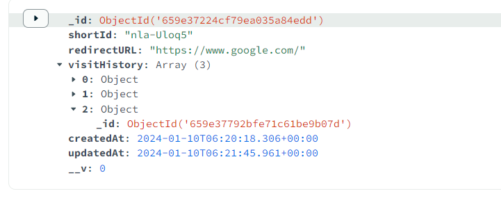

# This is the url shortner website based on Nodejs using the shortid Packages
- Package being used in this code

```
- express
- mongoose
- nodemon
- shortid
```
> API testing kits = POSTMAN


### _MVC model is being practically used for structing the files and folder

### - Model is being used for dataBase to store the data as mention in the `urlSchema`
```sh

const urlSchema = new mongoose.Schema({
    shortId: {
        type:String,
        require:true,
        unique:true
    },
    redirectURL:{
        type:String,
        require:true     
    },
    visitHistory:[
        {
            timestamp:{
                type:Number
            }
        }
    ]
},{timestamps:true})

const URL  = mongoose.model('url',urlSchema)
```


### - Controller is being used to create a async function using `Model` to generate `8` numbers of url as shows in below code: 

```sh
const URL = require("../model/url")
async function generateNewShortURL(req,res){
    const body = req.body;
    if(!body.url) return res.status(400).json({error:'Url is required...'})


    const shortId = shortid(8); //=> "3Ny5WaZT-R"
    await URL.create({
        shortId:shortId ,//(nonoId),
        redirectURL:body.url,
        visitHistory:[],

    })
    return res.json(({id:shortId}))
}
```

# How code does work

- Code start with the POST reqest on the

1. `http://localhost:8001/url` 
2. we provide the website full url as object .
3.  By clicking POST, it provide us the unique id with have length 8 as we mention above


- As requested the provided url along with unique shortid is goes settle in the mongoDb database.



-  Then for testing purpose we use the GET method replacing `http://localhost:8001/url` with `http://localhost:8001/wnOaRWbwM`.


- All entries are recorded in the database when we clicked or visited the website using the shorted url.